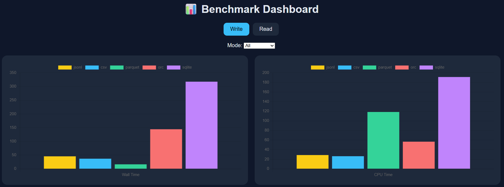
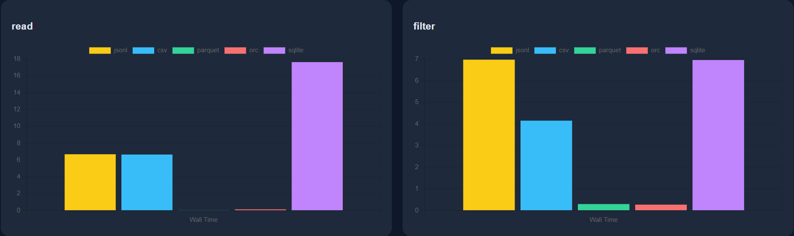

# Сравнение форматов хранения данных.

**Задачи:** 
1. Взять датасет на 10 ГБ
2. Похранить его в различных форматах
3. Выполнить различные SQL операции с этими файлами
4. Сделать график

# Подготовка окружения
1. python -m venv .bigdata  
2. .bigdata/Scripts/activate 
3. pip install -r requirements.txt 

# Загрузка датасета
`python take_10gb.py`  

Я взял датасет комментариев с Реддита: `fddemarco/pushshift-reddit-comments.`  
Датсет достаточно большой, поэтому я сделал выгрузку только 10Гб с помощью `take_10gb` 

# Сохраняем в различных форматах
`python scripts/benchmark_write.py`  

Форматы:
1. .csv
2. .jsonl
3. .orc
4. .parquet
5. .sqlite

*.json обраатывался слишком долго и убивал ядро, поэтому я отказался от него*

# Операции с различными форматами
`python scripts/benchmark_read.py`
Сделал 2 режима:
- direct - Запросы сразу к файлам - `read_parquet(...), read_csv_auto(...)` и.т.п
- materialized - Запросы через CREATE TEMP TABLE 

Операции:
1. read
2. filter
3. groupby
4. window
5. materialize

# Результаты

Посмотреть все дашборды: выполнить команду `python -m http.server 8000` и перейти на `http://localhost:8000/results/benchmark_dashboard.html`

## Write

## Read Direct

